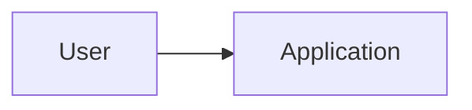

# Architecture

Architecture explains stable system structure. It should not prescribe every local implementation detail.

## 1. Architecture goals

List the quality goals that materially shape the system.

## 2. System context

- Users and external actors:
- External systems:
- Trust boundaries:
- Main inputs and outputs:

## 3. High-level diagram

Replace this only after the system is understood.



## 4. Components and responsibilities

| Component or module | Responsibility | Owns | Must not own | Public interface |
|---|---|---|---|---|
| | | | | |

## 5. Dependency direction

State allowed dependency direction explicitly.

Example:

```text
UI -> Application services -> Domain -> Infrastructure interfaces
Infrastructure implementations -> Domain interfaces
```

## 6. Data flow

Describe important workflows without duplicating low-level code documentation.

## 7. Data ownership and persistence

- Source of truth:
- Persistence strategy:
- Transaction boundaries:
- Migration strategy:
- Backup and recovery expectations:

## 8. External interfaces

| Interface | Direction | Contract owner | Stability expectation | Failure handling |
|---|---|---|---|---|
| | | | | |

## 9. Security and privacy boundaries

Describe authentication, authorization, secrets, sensitive data, trust transitions, and isolation at architecture level. Activate the optional security model for risk-sensitive projects.

## 10. Architectural invariants

These are rules a normal task must preserve.

- [ ] Add project-specific invariant

Examples:

- UI components do not access persistence directly.
- Business rules do not depend on framework-specific request objects.
- Secrets never enter client-side bundles.
- External service calls pass through the approved adapter.

## 11. Repository structure

Describe the intended structure and ownership. Keep a detailed living map in `docs/REPOSITORY_STRUCTURE.md` after implementation begins.

## 12. Known tradeoffs

| Decision | Benefit | Cost | Accepted by | Related ADR |
|---|---|---|---|---|
| | | | | |

## Architecture change rule

After approval, do not alter components, boundaries, dependency direction, persistence strategy, trust boundaries, or major interfaces through an ordinary task. Create an ADR or controlled change with impact analysis first.

## Approval checklist

- [ ] Components have clear responsibilities
- [ ] Dependency direction is explicit
- [ ] Data and trust boundaries are described
- [ ] Architecture supports approved scope without speculative systems
- [ ] Tradeoffs are visible
- [ ] User or authorized reviewer approved the baseline
